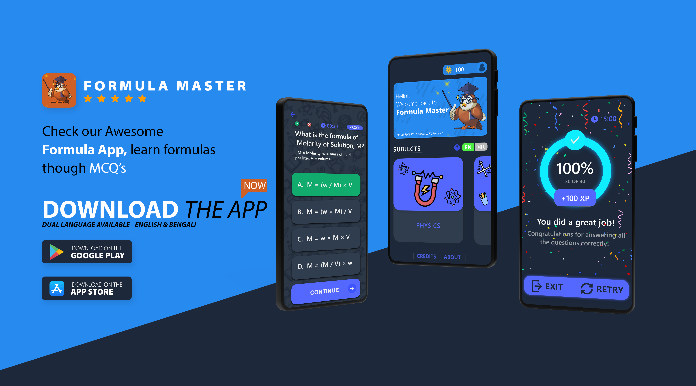

# Formula Master – Interactive Science Learning App

**Formula Master** is an interactive educational app that teaches Physics, Chemistry, and Mathematics formulas at the high school level. Built with multilingual support and a quiz-based system, the app was designed to help students understand, memorize, and explore the logic behind formulas in both **English** and **Bangla**.

This project was a personal initiative started during high school and actively developed through the early years of college, with the goal of making science education more engaging and accessible for bilingual learners.

---

## 📱 App Overview

Formula Master combines learning and assessment through:
- **MCQ-based quizzes** on high school formulas  
- **Step-by-step explanations or proofs** shown after each quiz submission  
- **Time tracking** and **correctness feedback** after each module  
- **Dual language support** (English and Bangla)  
- A now-beta **login system**, **best time/score tracking**, and a **leaderboard**

A partial version of the app has been live on the **Google Play Store**

---

---

## 🌟 Key Features

- 📚 **Subject Modules**  
  Covers core topics in high school Physics, Chemistry, and Math

- 🧠 **Quiz + Explanation System**  
  MCQ-based quizzes with immediate answer validation and detailed explanation of the formula used

- 🌐 **Bilingual Support**  
  Content is available in both **English** and **Bangla**

- ⏱ **Performance Feedback**  
  Tracks time taken and percentage of correct answers per module

- 🧾 **Leaderboard & Login (Beta)**  
  Includes a login system and personal score tracking (implemented but not publicly deployed)

---

## 💻 Tech Stack

- **React Native (JavaScript)** – mobile app framework  
- **CSS** – styling and UI implementation  
- **PHP** – backend for the web portal and leaderboard API  
- **MySQL** – database used for login and score tracking  
- **Freelancers** – assisted with UI assets, logo, and data preparation  
- **Self-developed bilingual formula database** – painstakingly built from scratch

---

## 👨‍💻 Development Notes

- The app’s core logic, user flow, and all quiz/explanation systems were implemented by me.  
- A partner contributed to the design elements, which I implemented into the frontend.  
- The most challenging part was the **creation of a large, bilingual formula dataset**, which caused significant delays.  
- While the codebase may not reflect best practices by today's standards, it is a fully working product that helped users on Android devices.  
- Development slowed significantly after starting college and falling behind updates in frameworks like React Native.  
- The project is currently **in a semi-abandoned state**, with most features implemented but not fully deployed or maintained.

---

## 🏁 Status

- ✅ Basic version available on the **[Google Play Store via official website](https://www.heliospherestudios.com/formulamaster.php)**  
- ⚠️ Full feature set (login, leaderboard) remains in beta/unreleased  

---

## 🧾 Credits

- **Development & Logic Design**: M Sadman Sakib  
- **UI Design**: S M Ashikuzzaman Hriddho  
- **Data Preparation & Graphics**: Freelance contributors

---

## 🎓 Background

This was a passion project created outside of formal coursework, aimed at solving a real problem: lack of accessible, structured formula learning tools for bilingual students.

Though it never reached its full potential, Formula Master remains a proud learning milestone that shaped my early development skills, UI/UX thinking, and problem-solving experience in multilingual edtech.

---

## 🌐 Website

🔗 [https://www.heliospherestudios.com/formulamaster.php](https://www.heliospherestudios.com/formulamaster.php)

---

## 📝 License

This project is not currently maintained. Contact for demo access or revival ideas.
